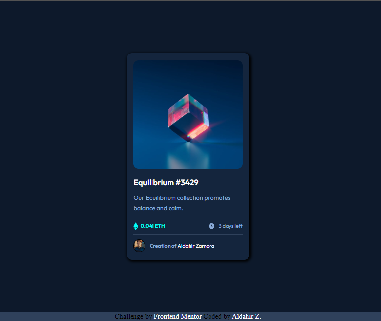

# Frontend Mentor - NFT preview card component solution

This is a solution to the [NFT preview card component challenge on Frontend Mentor](https://www.frontendmentor.io/challenges/nft-preview-card-component-SbdUL_w0U). Frontend Mentor challenges help you improve your coding skills by building realistic projects. 

## Table of contents

- [Overview](#overview)
  - [Screenshot](#screenshot)
  - [Links](#links)

- [My process](#my-process)
  - [Built with](#built-with)
  - [What I learned](#what-i-learned)
  
- [Author](#author)

## Overview

### Screenshot

### Links

- Solution URL: [Add solution URL here](https://github.com/Ronnal-Zp/cardNftComponent)
- Live Site URL: [Add live site URL here](https://ronnal-zp.github.io/cardNftComponent/)

## My process

### Built with

- Semantic HTML5 markup
- CSS custom properties
- Flexbox
- Mobile-first workflow

### What I learned

In this first project I was able to test my knowledge about flex, which was what I used to complete the challenge, obviously I also worked with the properties of the box model

## Author

- Linkedin - [Aldahir Zamora](https://www.linkedin.com/in/aldahir-zamora/)
- Frontend Mentor - [@Ronnal_Zp](https://www.frontendmentor.io/profile/Ronnal-Zp)
- GitHub - [@ronnal-zp](https://github.com/Ronnal-Zp)
